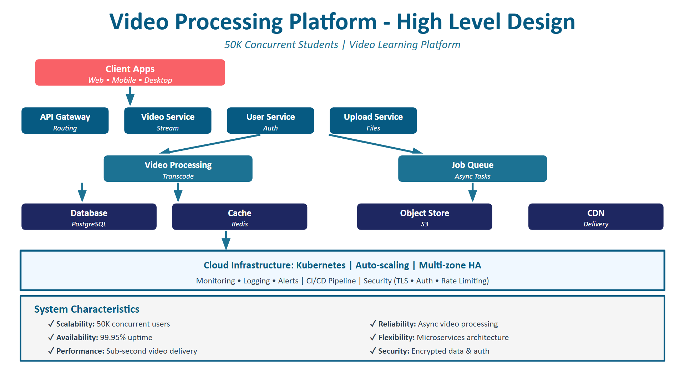
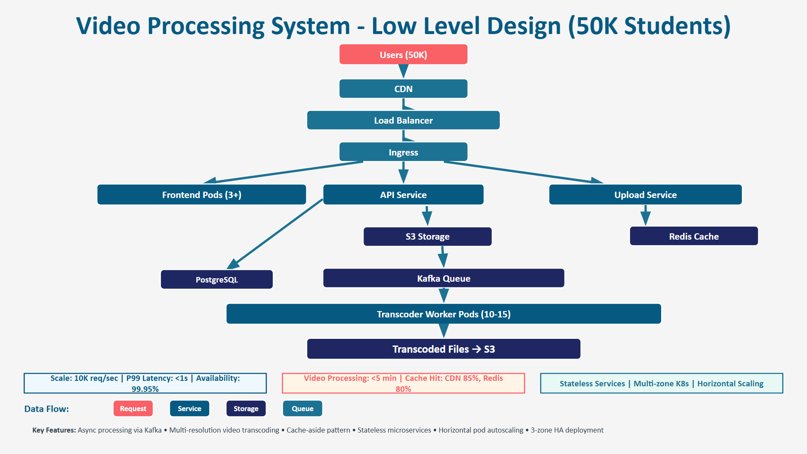

# Academix Video Learning Platform

This repository contains a video-based learning platform featuring:

- AI-generated summaries, transcripts, and key concepts via Google Gemini
- **Live AI augmentation**: dynamic section summaries and key concept suggestions based on current playback time, plus clickable transcripts and captions
- Lecture upload, transcoding simulation, and metadata extraction
- Progress tracking with WebSocket updates and resume on replay
- Transcript search and export (TXT/SRT)
- AI‑generated, improved transcripts with one‑click regeneration
- Admin dashboard analytics and job retry support

## Sprint #3: Ingress and External Traffic Routing

- Ingress architecture notes: `video-processing-platform/docs/ingress-traffic-flow.md`
- Local setup (including ingress controller): `video-processing-platform/k8s/local-cluster-setup.md`

## Sprint #3: CI/CD Pipeline Design and Workflow Stages

- Pipeline design document: `video-processing-platform/docs/cicd-pipeline-design.md`
- Video narration guide: `video-processing-platform/docs/cicd-video-demo-script.md`
- Workflows reflecting stage separation:
  - `.github/workflows/backend-ci.yml`
  - `.github/workflows/frontend-ci.yml`
  - `.github/workflows/deploy-k8s.yml`

## Sprint #3: GitHub Actions Continuous Integration (CI)

- Working CI workflow: `.github/workflows/ci.yml`
- CI implementation notes: `video-processing-platform/docs/ci-github-actions.md`
- CI triggers: `pull_request`, `push` to `main`, and `workflow_dispatch`
- CI quality gates:
  - Backend: lint + tests
  - Frontend: lint + production build

## Sprint #3: Observability (Metrics, Logs, Traces)

- Observability concepts and project mapping: `video-processing-platform/docs/observability-metrics-logs-traces.md`
- Video demo script: `video-processing-platform/docs/observability-video-demo-script.md`
- Practical backend observability additions:
  - Request correlation header (`X-Request-ID`)
  - Request latency/status logs
  - Lightweight metrics endpoint: `GET /observability/metrics-snapshot`

## Sprint #3: Monitoring with Prometheus and Grafana

- Monitoring setup guide: `video-processing-platform/docs/prometheus-grafana-monitoring.md`
- Kubernetes monitoring manifests: `video-processing-platform/k8s/monitoring/prometheus-grafana.yaml`
- Prometheus scrape endpoint exposed by backend: `GET /metrics`

## UI Improvements

The student library and other pages have been tightened up with narrower containers and reduced spacing to fit more cleanly on smaller screens. Video cards are more compact, and live transcript highlighting keeps learners focused.

### Transcript Panel

Within the lecture view the transcript is now an AI‑generated approximation of the lecture content rather than a raw description. Students can click "Improve with AI" at the top of the transcript pane to ask Gemini for a richer, more polished set of timestamped segments. The UI updates in place and the backend stores the improved version for future visits.

Other usability upgrades include a built‑in search box with real‑time highlighting, a "Copy" link to grab the entire transcript to the clipboard, and clear feedback when no entries match the query. Export buttons (TXT/SRT) are still available for offline use.

description below...

# Artifact Flow in CI/CD

**Source → Image → Registry → Cluster**

In this learning task, I understood how a **small code change** moves from **Git** to a **running application in Kubernetes** using a CI/CD pipeline.

Earlier, I thought code is deployed directly.
Now I understand that **code is first converted into an artifact (Docker image)** and only that artifact is deployed.

---

## 🔹 What I Learned About Source Code (Git)

* Every change starts with a **Git commit**
* A commit has a **unique commit hash**
* This commit clearly tells **which version of code** is being built

📌 **Learning:**
The commit hash is the identity of the code.

---

## 🔹 What I Learned About CI Pipeline

* CI pipeline starts automatically when code is pushed or merged
* CI does **not deploy code**
* CI:

  * Pulls the code
  * Runs tests
  * Builds a Docker image
  * Tags the image

📌 **Learning:**
CI’s main job is to **create a Docker image artifact**, not deployment.

---

## 🔹 What I Learned About Docker Images

* A Docker image contains:

  * Code
  * Runtime
  * Dependencies
* Once an image is built, it **never changes**
* Any new code change creates a **new image**

Example:

```
Commit A → app:commit-a1b2
Commit B → app:commit-b3c4
```

📌 **Learning:**
Docker images are **immutable**, which makes systems reliable.

---

## 🔹 What I Learned About Container Registry

* Docker images are stored in a **container registry**
* Kubernetes does **not** pull code from Git
* Kubernetes pulls **images from the registry**

📌 **Learning:**

* **Image tags** are human-friendly names
* **Image digests** uniquely identify the exact image
* Registries help in **versioning and traceability**

---

## 🔹 What I Learned About Kubernetes Deployment

* Kubernetes Deployments mention:

  * Image name
  * Image tag
  * Number of replicas
* Kubernetes:

  * Pulls image from registry
  * Runs containers
  * Restarts failed containers
  * Performs rolling updates

📌 **Learning:**
Kubernetes runs **sealed images**, not source code.

---

## 🔹 What I Learned About Rollbacks

* Rollbacks are easy because:

  * Images are immutable
  * Registries store old images
  * Deployment points to a specific image

If a release fails:

* Select the previous image
* Redeploy it
* Kubernetes rolls back safely

📌 **Learning:**
No rebuilding. No guessing. Just redeploy an old image.

---

## 🔹 Complete Flow I Learned

```
Git Commit
   ↓
CI Pipeline
   ↓
Docker Image
   ↓
Container Registry
   ↓
Kubernetes Cluster
```

---

#  Kubernetes Application Lifecycle & Deployment Mechanics

## Overview

This document explains how Kubernetes manages application workloads throughout their lifecycle — from creation and scheduling to updates, failures, and recovery.

It covers:

- Deployment → ReplicaSet → Pods
- Rolling updates
- Health probes
- Resource configuration
- Pod failure states
- Self-healing behavior

---

# 1️ Kubernetes Lifecycle (Deployment → ReplicaSet → Pods)

## Desired State vs Current State

Kubernetes works using a **desired state model**.

When we create a Deployment, we define the desired state of the system.  
For example:

- Run 3 replicas
- Use image version v1
- Maintain high availability

Kubernetes continuously compares the **current state** of the cluster with the **desired state**.

If there is any difference, Kubernetes automatically corrects it.  
This continuous correction process is called **reconciliation**.

---

## Deployment → ReplicaSet → Pods Flow

###  Deployment
- Defines the desired state (replica count, image version, update strategy).
- Manages updates and rollbacks.
- Creates and manages ReplicaSets.

###  ReplicaSet
- Created automatically by the Deployment.
- Ensures the specified number of Pods are always running.
- Recreates Pods if they fail.

###  Pods
- Smallest deployable unit in Kubernetes.
- Contain one or more containers.
- Run the application.

---

## Pod Scheduling Process

1. Deployment creates a ReplicaSet.
2. ReplicaSet creates Pods.
3. The Kubernetes Scheduler:
   - Checks available Nodes.
   - Evaluates CPU & memory availability.
4. Pod is assigned to a suitable Node.
5. The kubelet on that Node starts the container.

---

## What Happens if a Pod Crashes?

- If a container crashes → kubelet restarts it.
- If a Pod fails completely → ReplicaSet creates a new Pod.
- If a Node fails → Pods are rescheduled to other Nodes.

This automatic recovery behavior is called **self-healing**.

---

# 2 Deployment & Rolling Update Mechanics

## How Rolling Updates Work

When we update an application (for example, image v1 → v2):

1. Deployment creates a new ReplicaSet with the new image.
2. New Pods are started gradually.
3. Old Pods are terminated slowly.
4. Availability is maintained using:
   - `maxUnavailable`
   - `maxSurge`

This ensures zero or minimal downtime.

---

## Successful Rollout

A rollout is successful when:

- All new Pods are running and ready.
- Old ReplicaSet is scaled down to zero.
- Application is fully running on the new version.

---

## Failed Rollout

If new Pods fail to start:

- They may enter CrashLoopBackOff.
- Readiness probes may fail.
- Deployment rollout pauses.
- Kubernetes allows rollback to the previous working version.

ReplicaSets track both:
- Old version
- New version

---

# 3️ Health Probes & Resource Configuration

## Health Probes

###  Liveness Probe
- Checks if the container is alive.
- If it fails → container is restarted.

###  Readiness Probe
- Checks if the container is ready to serve traffic.
- If it fails → Pod is removed from Service endpoints.

###  Startup Probe
- Used for slow-starting applications.
- Prevents early restarts during initialization.

---

## CPU & Memory Configuration

### Resource Requests
- Used by the scheduler.
- Determines where the Pod can be placed.
- Ensures sufficient resources are reserved.

### Resource Limits
- Maximum resources a container can use.
- If memory exceeds limit → container is OOMKilled.
- If CPU exceeds limit → CPU throttling occurs.

---

## Impact of Misconfiguration

Incorrect configuration can cause:

- CrashLoopBackOff (due to failed probes)
- OOMKilled (due to low memory limit)
- Pending state (due to high resource requests)
- Unavailable application (due to readiness probe failure)

---

# 4️ Common Pod States & Failure Conditions

##  Pending
**Meaning:** Pod created but not scheduled.  
**Cause:** Insufficient resources or constraints.  
**Response:** Kubernetes waits until resources are available.

---

##  CrashLoopBackOff
**Meaning:** Container keeps crashing repeatedly.  
**Cause:** Application errors or bad configuration.  
**Response:** Kubernetes retries with exponential backoff.

---

##  ImagePullBackOff
**Meaning:** Failed to pull container image.  
**Cause:** Incorrect image name or registry issue.  
**Response:** Kubernetes retries pulling the image.

---

##  OOMKilled
**Meaning:** Container exceeded memory limit.  
**Cause:** Memory limit too low or memory leak.  
**Response:** Kubernetes kills and restarts container.

---

# 5️ Kubernetes Lifecycle Diagram

```

Deployment
↓
ReplicaSet
↓
Pod Creation
↓
Scheduler Assigns Node
↓
Container Start (kubelet)
↓
Health Checks (Probes)
↓
Running State
↙             ↘
Restart        Reschedule

```

Export this diagram as an image and attach it to your PR.

---

# 6️ Reflection

Kubernetes focuses on maintaining the **desired state**, not application correctness.

The platform:

- Automates deployment and scaling
- Provides self-healing
- Maintains infrastructure reliability

However, Kubernetes cannot fix:

- Application logic bugs
- Business logic errors

There is a clear boundary:

- Kubernetes ensures infrastructure health.
- Developers ensure application correctness.

This separation allows Kubernetes to provide reliable automation while keeping responsibility clearly divided.


#  CI/CD Pipeline Execution Model & Responsibility Boundaries


## CI/CD Execution Model (Big Picture)

```
Code Change
   ↓
CI Pipeline (Build & Test)
   ↓
Artifact Creation (Docker Image)
   ↓
CD Pipeline (Deploy)
   ↓
Infrastructure (Kubernetes / Cloud)
```

Each stage has a clear responsibility and ownership boundary.

---

## Continuous Integration (CI)

**Purpose:** Validate code before merge.

### CI Responsibilities

* Checkout source code
* Install dependencies
* Run unit tests
* Run lint/static analysis
* Build Docker image
* Tag image
* Push image to container registry

### Key Rule

> CI answers: **“Is this code safe to merge?”**

### Triggered By

* Pull Requests
* Commits to branches

---

## Continuous Deployment (CD)

**Purpose:** Deploy already validated artifacts.

### CD Responsibilities

* Pull pre-built Docker image
* Update Kubernetes manifests
* Apply manifests to cluster
* Trigger rolling updates
* Manage rollbacks

### Key Rule

> CD answers: **“How do we safely run this version?”**

 CD does **NOT** rebuild code. It deploys artifacts created by CI.

---

##  Where Actions Happen

| Action                 | Responsibility   |
| ---------------------- | ---------------- |
| Writing business logic | Application Code |
| Writing unit tests     | Application Code |
| Running tests          | CI               |
| Building Docker image  | CI               |
| Tagging image          | CI               |
| Pushing to registry    | CI               |
| Updating K8s manifests | CD               |
| Applying manifests     | CD               |
| Restarting failed pods | Kubernetes       |

---

## 🏗 Responsibility Boundaries

### 1️⃣ Application Code

* Implements features
* Defines tests
* Does NOT deploy itself

### 2️⃣ CI Pipeline

* Validates code
* Builds artifacts
* Fails fast on errors

### 3️⃣ CD Pipeline

* Deploys artifacts
* Updates environments
* Handles rollouts

### 4️⃣ Infrastructure (Kubernetes)

* Runs workloads
* Maintains desired state
* Self-heals failures

---

##  Why Separation Matters

* Prevents accidental production deployments
* Enables safe Pull Request reviews
* Reduces blast radius of errors
* Makes rollbacks predictable
* Improves system reliability

---

## Safe Pipeline Modifications

Pipeline changes must be:

* Small
* Reviewed carefully
* Intentionally scoped
* Version controlled

### Impact Awareness

| Change Type            | Affects       |
| ---------------------- | ------------- |
| Test step change       | CI validation |
| Build step change      | Artifacts     |
| Deployment step change | Live systems  |

---

## Common Misconceptions

| Incorrect Thinking           | Correct Model              |
| ---------------------------- | -------------------------- |
| CI deploys code              | CI validates code          |
| CD rebuilds app              | CD deploys artifacts       |
| Pipelines replace Kubernetes | Kubernetes manages runtime |

---

## Interaction with Kubernetes

CD applies manifests to Kubernetes.

Kubernetes:

* Schedules pods
* Performs rolling updates
* Restarts failed containers
* Maintains desired state

Pipelines orchestrate actions.
Kubernetes executes runtime behavior.

# DevOps Workstation Setup – Sprint #3 (Windows)

## 1. System Overview

- **Operating System:** Windows 10/11
- **Shell:** PowerShell
- **Virtualization:** WSL2 and Docker Desktop

## 2. Installed DevOps Tools

### 2.1 Git

- **Installation Method:** Git for Windows (`git-scm.com`)
- **Verification Command:**

```powershell
git --version
git config --list
```

- **Sample Output:**

```text
git version 2.45.0.windows.1
user.name=Your Name
user.email=your.email@example.com
```

---

### 2.2 Docker Desktop

- **Installation Method:** Docker Desktop for Windows (`docker.com/products/docker-desktop`)
- **Verification Commands:**

```powershell
docker version
docker info
```

- **Sample Output (excerpt):**

```text
Client: Docker Engine - Community
Server: Docker Desktop
 Server Version: 27.0.0
```

---

### 2.3 Kubernetes (Docker Desktop)

- **Installation Method:** Enable Kubernetes in Docker Desktop → Settings → Kubernetes
- **Verification Commands:**

```powershell
kubectl config current-context
kubectl get nodes
kubectl cluster-info
```

- **Sample Output:**

```text
CURRENT CONTEXT: docker-desktop

NAME             STATUS   ROLES           AGE   VERSION
docker-desktop   Ready    control-plane   10m   v1.29.0
```


---

### 2.4 kubectl

- **Installation Method:** `winget install Kubernetes.kubectl`
- **Verification Command:**

```powershell
kubectl version --client
```

- **Sample Output:**

```text
Client Version: v1.29.0
```

---

### 2.5 Helm

- **Installation Method:** `winget install Helm.Helm`
- **Verification Commands:**

```powershell
helm version
helm repo add bitnami https://charts.bitnami.com/bitnami
helm repo list
```

- **Sample Output:**

```text
version.BuildInfo{Version:"v3.14.0", ...}

NAME    URL
bitnami https://charts.bitnami.com/bitnami
```

---

### 2.6 curl and Supporting CLI Tools

- **Installation Method:**
  - `curl` via built-in Windows or `winget install curl.curl`
  - `jq` via `winget install jqlang.jq`
- **Verification Commands:**

```powershell
curl --version
jq --version
```

- **Sample Output:**

```text
curl 8.5.0 (Windows) ...
jq-1.7
```

---

## 3. Sample Kubernetes Deployment

This section documents a simple application deployed to the local Kubernetes cluster to prove functional readiness.

### 3.1 Namespace

File: `k8s/sample-namespace.yaml`

```yaml
apiVersion: v1
kind: Namespace
metadata:
  name: devops-lab
```

Apply:

```powershell
kubectl apply -f k8s/sample-namespace.yaml
kubectl get ns
```

### 3.2 Deployment and Service

File: `k8s/sample-deployment.yaml`

```yaml
apiVersion: apps/v1
kind: Deployment
metadata:
  name: hello-deployment
  namespace: devops-lab
spec:
  replicas: 1
  selector:
    matchLabels:
      app: hello-app
  template:
    metadata:
      labels:
        app: hello-app
    spec:
      containers:
        - name: hello-container
          image: nginx:stable
          ports:
            - containerPort: 80
```

File: `k8s/sample-service.yaml`

```yaml
apiVersion: v1
kind: Service
metadata:
  name: hello-service
  namespace: devops-lab
spec:
  type: ClusterIP
  selector:
    app: hello-app
  ports:
    - port: 80
      targetPort: 80
```

Apply:

```powershell
kubectl apply -f k8s/sample-deployment.yaml
kubectl apply -f k8s/sample-service.yaml
kubectl get all -n devops-lab
```

---

## 4. Troubleshooting Summary

Common issues and fixes are documented in `docs/troubleshooting.md` and include:

- PATH issues for `git`, `kubectl`, `helm`, and `curl`
- Docker daemon not running
- Kubernetes context misconfiguration

---

## 5. Evidence Checklist for Academic Submission

- [ ] `devops-setup/` directory checked into version control
- [ ] Screenshots of all tool versions and Kubernetes resources
- [ ] Text logs of key verification commands in `logs/`
- [ ] Sample Kubernetes deployment and service manifest files
- [ ] README updated with final versions and dates
- [ ] Git commit and Pull Request link documented

# High and Low Fidelity Architecture

## Overview

**Architecture Design** is a critical phase in DevOps and system planning. It helps us visualize and understand how different components interact before implementation. There are two main levels of architectural detail:

1. **High Fidelity Design (HFD)** - Detailed, comprehensive architecture
2. **Low Level Design (LLD)** - Simplified, high-level overview

---

## High Fidelity Design (HFD)

**Purpose:** Detailed representation of the complete system architecture.

### Characteristics

- **Complete Detail:** Shows all components, services, and their interactions
- **Technical Depth:** Includes specific technologies, databases, caching layers
- **Implementation Ready:** Serves as a blueprint for developers and DevOps engineers
- **Component Relationships:** Clearly shows how each service communicates
- **Error Handling:** Includes failover mechanisms and backup strategies

### Benefits

 Provides precise implementation guidance  
 Identifies potential bottlenecks  
 Helps with capacity planning  
 Enables thorough testing strategy  

### HFD Diagram



---

## Low Level Design (LLD)

**Purpose:** Simplified, high-level overview of the system architecture.

### Characteristics

- **High-Level View:** Shows only critical components and main flows
- **Simplified Relationships:** Abstracts implementation details
- **Quick Understanding:** Easy to grasp for stakeholders
- **Decision Making:** Useful for architectural decisions and trade-offs
- **Business Focus:** Emphasizes business capabilities over technical details

### Benefits

 Easy to communicate to non-technical stakeholders  
 Quick overview for decision makers  
 Useful for initial planning phases  
 Helps identify major system boundaries  

### LLD Diagram



---

## Relationship Between HFD and LLD

| Aspect | HFD | LLD |
|--------|-----|-----|
| Detail Level | High | Low |
| Audience | Developers, DevOps | Stakeholders, Managers |
| Purpose | Implementation | Planning & Communication |
| Complexity | Complex | Simple |
| Use Case | Building | Decision Making |

---

## When to Use Each

### Use HFD When
- Building and implementing the system
- Planning detailed infrastructure
- Designing CI/CD pipelines
- Conducting code reviews
- Planning disaster recovery

### Use LLD When
- Presenting to business stakeholders
- Making high-level architectural decisions
- Planning budgets and resources
- Onboarding new team members
- Creating project proposals

---

## Structured Version Control Workflow

This repository follows a structured Git workflow so that changes are traceable, reviewable, and safe to integrate.

### 1) Branching Strategy

- `main` is the stable branch and should always remain deployable.
- All new work is done in focused branches and merged through pull requests.
- Direct pushes to `main` are avoided for feature work.

Branch naming pattern used:

- `feature/<scope>` for new work
- `docs/<scope>` for documentation-only updates
- `fix/<scope>` for bug fixes
- `chore/<scope>` for maintenance

Examples:

- `feature/git-workflow-guidelines`
- `docs/sprint3-submission-notes`

### 2) Commit Message Convention

Commits should communicate intent, not just changed files.

Preferred format:

`<type>: <clear action and purpose>`

Common types:

- `feat`
- `fix`
- `docs`
- `chore`
- `refactor`

Good examples:

- `docs: add sprint 3 branching and commit conventions`
- `feat: add kubernetes rollout failure-state explanation`
- `fix: correct image tag flow in architecture diagram`

### 3) Pull Request Expectations

Each PR should represent one logical unit of work and include:

- A clear title describing intent
- A short summary of what changed
- Why the change was needed
- Screenshots when relevant
- Linked branch that matches the naming strategy

PR review checklist:

- [ ] Branch name is purposeful
- [ ] Commits are meaningful and focused
- [ ] Changes are related (no mixed unrelated updates)
- [ ] README/repo organization remains clear

### 4) Repository Organization

- `Readme.md` contains learning documentation and contribution workflow guidance.
- `screenshots/` stores visual references used in documentation and PR context.


# Dockerfile Engineering – Sprint #3

## Overview

This project demonstrates production-quality Dockerfile practices as part of Sprint #3. The objective is not just to build a working container, but to create an image that is:

* Efficient
* Predictable
* Optimized for caching
* Maintainable
* CI/CD-ready

This README explains the architectural decisions behind the Dockerfile structure.

---

## Role of the Dockerfile

A Dockerfile is a declarative build specification that defines how a container image is constructed.

In DevOps workflows:

* Dockerfiles are executed repeatedly in CI/CD pipelines.
* Builds must be deterministic.
* Images must not depend on local machine configuration.
* Inefficient instructions can significantly slow down pipelines.

For this reason, the Dockerfile in this project is structured intentionally to optimize build performance, reduce image size, and ensure consistent behavior across environments.

--

### Reasoning

The selected base image is:

* Minimal, reducing final image size
* Official and actively maintained
* Secure, with a smaller attack surface
* Appropriate for the required runtime

### Trade-offs

| Slim Image               | Full Image              |
| ------------------------ | ----------------------- |
| Smaller size             | Larger                  |
| Fewer preinstalled tools | More built-in utilities |
| Reduced attack surface   | Increased convenience   |

The slim variant was chosen to prioritize performance and security over convenience.

---

## Layers and Caching Strategy

Each Dockerfile instruction creates a new layer. Docker caches these layers to speed up subsequent builds.

If an early layer changes, all subsequent layers must be rebuilt. Therefore, instruction order directly affects build performance.

---

# Helm-Based Deployment – Sprint #3

## Overview

As part of Sprint #3, the application deployment has been migrated from raw Kubernetes manifests to a **Helm Chart**. Helm is a package manager for Kubernetes that simplifies the deployment, management, and scaling of containerized applications.

## Why Helm?

- **Reusability**: One chart can deploy to Dev, Staging, and Production by simply changing the `values.yaml`.
- **Versioning**: Every deployment is a "release" with a version number, making tracking changes easy.
- **Atomic Rollbacks**: If a deployment fails, you can roll back to the last known good state with a single command.
- **Templating**: Hardcoded values in YAML are replaced with placeholders, allowing dynamic configuration.

## Chart Structure

The Helm chart is located in `charts/video-processing-platform/`:

- `Chart.yaml`: Metadata about the chart (name, version, description).
- `values.yaml`: The default configuration for the entire application.
- `templates/`: Parameterized Kubernetes manifests for Backend, Frontend, and MongoDB.
- `_helpers.tpl`: Reusable logic for consistent naming and labeling across resources.

## Key Helm Commands

### 1. Install/Deploy
Deploys the application for the first time.
```powershell
helm install vpp ./charts/video-processing-platform
```

### 2. Upgrade
Applies changes to the deployment (e.g., updating an image tag or replica count).
```powershell
helm upgrade vpp ./charts/video-processing-platform --set backend.replicaCount=5
```

### 3. Rollback
Reverts to a previous revision if something goes wrong.
```powershell
helm rollback vpp 1
```

### 4. History & Status
Check the release history and current status.
```powershell
helm history vpp
helm status vpp
```

### 5. Uninstall
Removes all resources associated with the release.
```powershell
helm uninstall vpp
```

## Parameterized Values

Key parameters available in `values.yaml` include:
- `replicaCount`: Number of pods for each service.
- `image.repository` & `image.tag`: Container image details.
- `service.type` & `service.port`: Networking configuration.
- `resources.requests` & `resources.limits`: CPU/Memory allocation.
- `persistence.size`: Storage size for databases and uploads.


### Optimization Strategy

1. Place rarely changing instructions early.
2. Place frequently changing application code later.
3. Separate dependency installation from application code copying.

---

## Best Practices Applied

### 1. Minimal Image Size

* Used slim base image.
* Avoided unnecessary packages.
* Used `--no-cache-dir` when installing dependencies.

### 2. Logical Instruction Ordering

* Dependencies installed before copying full source.
* Frequently changing files placed later.

### 3. Deterministic Builds

* No reliance on local environment.
* All dependencies declared explicitly.
* Explicit working directory defined.

### 4. Security Considerations

* Avoid running containers as root (if applicable).
* Only required artifacts included in final image.
* Avoided unnecessary build tools in runtime image.

### 5. Readability and Maintainability

* Clear separation of build steps.
* Minimal but meaningful comments.
* Logical grouping of related instructions.

---

## From Dockerfile to Image Artifact

The Dockerfile serves as a blueprint for producing a reusable image artifact.

The resulting image:

* Can be built locally or in CI pipelines.
* Behaves consistently across environments.
* Is portable and deployable to container platforms.

Build command:

```bash
docker build -t my-app:latest .
```

Run command:

```bash
docker run -p 8000:8000 my-app:latest
```

---

## Conclusion

This Dockerfile is structured with engineering intent rather than trial-and-error experimentation. It prioritizes:

* Performance
* Security
* Predictability
* Maintainability

The goal is to produce a reliable container image that builds consistently and integrates smoothly into automated DevOps workflows.

---

# Introduction to Containers & Containerization

## Overview

In this lesson, I learned **why containers exist**, **what problems they solve**, and **how they are different from virtual machines**.
The focus was not on writing Dockerfiles or running containers, but on building a **strong conceptual understanding** of containerization in modern DevOps workflows.

---

## Why Containers Emerged

Before containers, applications were deployed:

* Directly on servers, or
* Inside virtual machines

This caused many problems such as:

* “Works on my machine” issues
* Dependency conflicts
* Slow setup and deployment
* Different behavior in dev, test, and production

**Containers solved this** by packaging the application **along with all its dependencies** into one portable unit that runs the same everywhere.

---

## What a Container Really Is

A container:

* Is **not a virtual machine**
* Does **not run its own operating system**
* Shares the **host OS kernel**
* Runs the application in an isolated environment

Because of this:

* Containers are **lightweight**
* Start **very fast**
* Use **less resources** compared to virtual machines

A container acts as a **standard runtime boundary** for applications.

---

## Containers vs Virtual Machines

| Feature        | Containers           | Virtual Machines              |
| -------------- | -------------------- | ----------------------------- |
| OS             | Share host OS        | Separate OS for each VM       |
| Startup Time   | Very fast (seconds)  | Slow (minutes)                |
| Resource Usage | Low                  | High                          |
| Size           | Small                | Large                         |
| Best For       | CI/CD, microservices | Strong isolation, legacy apps |

Containers trade some isolation for **speed, simplicity, and scalability**, which is ideal for modern DevOps systems.

---

## Role of Containers in CI/CD

Containers fit naturally into CI/CD pipelines because:

* Same environment is used for **build, test, and production**
* Reduces environment mismatch issues
* Pipelines become more **reliable and repeatable**

In modern delivery:

* Code → Container Image → Registry → Deployment
  This makes releases **faster, safer, and consistent**.

---

## Common Use Cases of Containers

Containers are commonly used for:

* Backend services
* Frontend applications
* Background workers
* Test and build tools
* Standardized developer environments

# Kubernetes Deployment

## Overview

This sprint transitions the project from managing individual Pods/ReplicaSets to using a **Kubernetes Deployment**, which is the recommended way to run applications in production.

The Deployment manages:

* Desired state of the application
* Replica management
* Rolling updates
* Application lifecycle

---

## Deployment Details

* **API Version:** apps/v1
* **Replicas:** 2
* **Strategy:** RollingUpdate
* **Container Image:** nginx (version updated during demo)
* **Port:** 80

---

## How It Works

1. The Deployment YAML defines the desired state.
2. `kubectl apply` is used to create or update the Deployment.
3. If the Deployment already exists, Kubernetes updates it declaratively.
4. Rolling updates ensure zero downtime by gradually replacing old Pods.

---

## Commands Used

Create / Apply Deployment:

```bash
kubectl apply -f deployment.yaml
```

Verify Deployment:

```bash
kubectl get deployments
kubectl get pods
kubectl rollout status deployment/my-app-deployment
```

Update Deployment (example: change image version):

```bash
kubectl apply -f deployment.yaml
```

---

## What Was Demonstrated

* Creation of Deployment using YAML
* Verification of running Pods
* Updating container image
* Rolling update behavior
* Rollout status check

---

## Why Deployment Instead of Pods?

* Automatically manages ReplicaSets
* Maintains desired state
* Supports safe rolling updates
* Enables scaling and rollback

---
## Managing Resource Requests and Limits

To improve cluster stability and control resource usage, CPU and memory requests and limits were configured for the Deployment.

Configuration Added
resources:
  requests:
    cpu: "100m"
    memory: "128Mi"
  limits:
    cpu: "250m"
    memory: "256Mi"
### Why These Values?

CPU Request (100m): Ensures the Pod gets guaranteed minimum CPU for stable execution.

Memory Request (128Mi): Ensures the Pod is scheduled only on nodes with enough memory.

CPU Limit (250m): Prevents excessive CPU usage.

Memory Limit (256Mi): Prevents the Pod from consuming too much memory and impacting other workloads.

### How Kubernetes Uses Them

Requests are used by the scheduler to decide where the Pod can run.

Limits restrict the maximum resources the container can consume.

If memory exceeds the limit → Pod is terminated (OOMKilled).

If CPU exceeds the limit → CPU is throttled.

### Benefits

Prevents noisy-neighbor problems

Improves cluster stability

Enables predictable scaling

Ensures fair resource distribution# Academix
